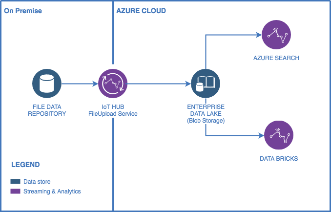
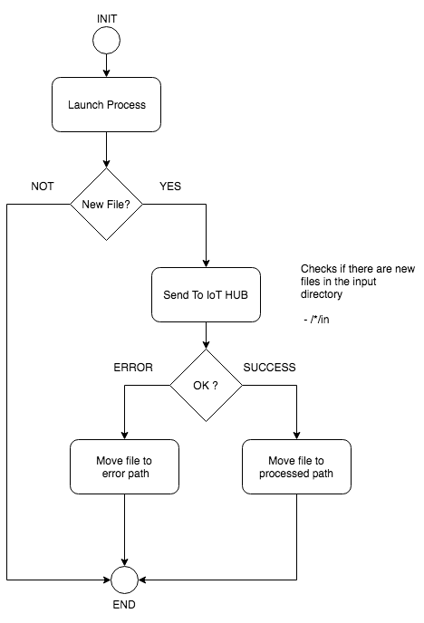
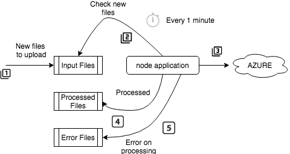

# nodejs-up-file-azure-hub

Simple MFT application to upload bulk files from on-premise to Azure IoT HUB &amp; Blob Storage.

## Diagram Achitecture

### Flow Diagram

### Detailed Flow Diagram

## How to

### Software prerequisites

| Product         | Version                |
|:---------------:|:-----------------------|
| npm             | 6.9.0                  |   
| nodejs          | 10.16.0                | 
| azure cli       | 2.0.68                 |

### Azure

#### Create Container Blob Storage

#### Create IoT Hub

### nodejs-up-file-azure-hub

#### Setting Properties

The files properties are located on path "./env/". This files are composed by the following attributes:

| Section         | Propertie              | Description                                        | 
|:---------------:|:-----------------------|:---------------------------------------------------|
| main            | app.port               | Nodejs Express Server  Port                        |     
| files           | in.path                | Path to read new files                             |  
| files           | processed.path         | Path to storage files processed                    | 
| files           | error.path             | Path to storage files for which processing failed  | 
| azure           | iot.connection.string  | Service bus namespace connection string            | 

### Run application

> npm start env=development 

### API

| Resource        | Verb                   | Description                                        | 
|:---------------:|:-----------------------|:---------------------------------------------------|
| files           | GET                    | Return task status: Started:Stopped                |     
| files           | POST                   | To start cron task                                 |  
| files           | DELETE                 | To stop cron task                                  | 
| healthcheck     | GET                    | To get application uptime                          |

> curl -X <Verv> http://<url>:<port>/<Resource>
